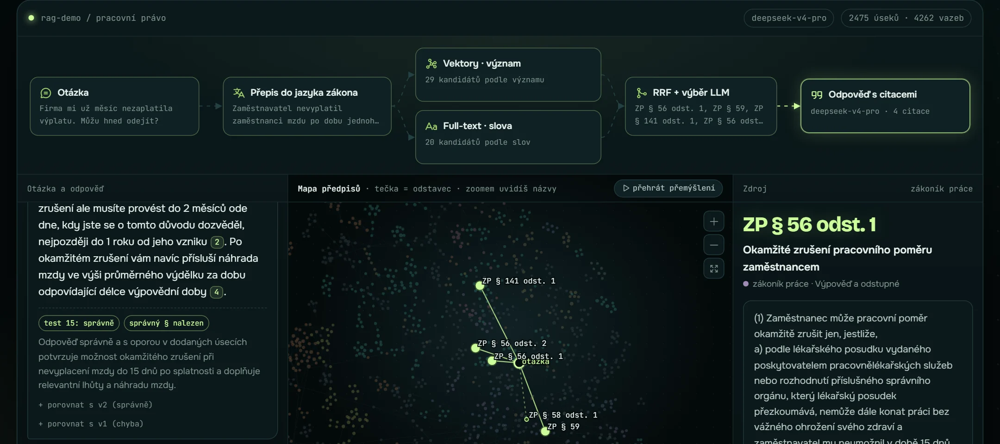

# RAG asistent nad pracovním právem

[](https://github.com/zenkovski/rag-demo/actions/workflows/tests.yml)

Odpovídá česky na otázky z pracovního práva. Odpovídá jen z textu zákona, každou odpověď ocituje a když odpověď v zákoně není, řekne „nevím“.

*Czech RAG assistant over 4 labour-law acts (2,475 paragraphs): hybrid search, LLM reranking, cited answers, measured on 66 hand-checked questions.*

**Živě: [lukas-rag.vercel.app](https://lukas-rag.vercel.app)**



## Co to umí

- Prohledá **4 předpisy, 2 475 odstavců**: zákoník práce, zákon o zaměstnanosti, zákon o nemocenském pojištění a nařízení o překážkách v práci.
- U odpovědi cituje konkrétní odstavce. Klik na citaci ukáže původní text.
- Mapa předpisů ukáže, jak asistent hledal: každá tečka je odstavec, nalezené svítí.
- U nejasné otázky se doptá („mzda, nebo plat?“) nebo odpoví pro každou variantu.
- Chyby neschovává. U každé chyby web ukáže, kde vznikla: v **hledání**, nebo ve **čtení**.

> Není to právní porada. Je to technická ukázka.

## Výsledky

Odpovědi hodnotí AI soudce (DeepSeek). Každou pak ještě jednou porovná s textem zákona Claude Opus 5.5 a já jsem výsledky prošel a schválil. Platí ten druhý verdikt.

| Co měřím | Výsledek |
|---|---|
| Otázky napsané předem, před spuštěním verze | **20 z 20** (předchozí verze 18 z 20) |
| Ukázkové otázky mimo testy | **14 z 16** (obě chyby jsou vidět na webu) |
| Past: odpověď v zákonech není, správně je „nevím“ | **10 z 10** |
| Správný paragraf mezi 5 úseky, které model dostane | **56 z 56** (cross-encoder pro srovnání 52, viz [DESIGN.md](DESIGN.md#5-výběr-5-z-20-llm-nebo-cross-encoder)) |

Celkem 66 z 66, ale toto číslo je nadsazené: podle části otázek jsem ladil. Poctivé jsou řádky výše. Podrobně: [RESULTS.md](RESULTS.md).

## Jak to funguje

```
otázka
  → přepis do jazyka zákona            („výplata“ → „mzda“)            deepseek-v4.1-flash
  → hledání podle významu + podle slov (e5-large + BM25, spojení RRF) → 20 kandidátů
  → LLM vybere 5 úseků                 (+ odstavec 1 a odkazované odstavce téhož §)
  → odpověď jen z těchto 5, s citacemi                                 deepseek-v4-pro
```

Stejné hledání je napsané třikrát: ručně v Pythonu, v LangChainu a v JavaScriptu na webu. Všechny tři vrací stejných 5 úseků u 66 z 66 otázek.

## Soubory

| Soubor | Co dělá |
|---|---|
| `tools/chunk.py` | stáhne předpisy a rozdělí je na odstavce (`ZP § 56 odst. 1`) |
| `tools/rag.py` | celý postup: embeddingy, BM25, RRF, výběr, odpověď |
| `tools/rag_langchain.py` | stejný postup v LangChainu (LCEL) |
| `tools/evaluate.py` | měření na 66 otázkách → `RESULTS.md` |
| `tools/rerank_compare.py` | výběr přes LLM proti cross-encoderu (zdarma, z cache) |
| `tools/build_data.py` | data a rozložení mapy pro web |
| `site/index.html` | web (jeden soubor, D3 mapa) |
| `site/api/ask.js` | serverová funkce pro vlastní otázky (Vercel) |
| `data/testset*.json` | testovací otázky se správnými odpověďmi |
| `data/manual_review.json` | verdikty druhé kontroly |
| `tests/` | 14 testů bez API, včetně kontroly, že web hledá stejně jako Python |

Další dokumenty:
- [RESULTS.md](RESULTS.md): výsledky otázku po otázce.
- [HISTORY.md](HISTORY.md): co se změnilo ve v1 → v3.1 a proč.
- [DESIGN.md](DESIGN.md): každé rozhodnutí, proč padlo a co by chybělo do provozu.

## Spuštění

```bash
py -3.13 -m venv .venv
.venv/Scripts/python -m pip install -r requirements.txt
copy .env.example .env                                   # doplň OPENROUTER_API_KEY

.venv/Scripts/python tools/chunk.py                       # stáhne a rozdělí předpisy
.venv/Scripts/python tools/rag.py "Nezaplatili mi výplatu, můžu odejít?"
.venv/Scripts/python tools/evaluate.py                    # měření -> RESULTS.md
.venv/Scripts/python tools/rag_langchain.py --compare     # LangChain = stejné výsledky?
.venv/Scripts/python tools/build_data.py                  # data pro web (~3 min)
.venv/Scripts/python -m pytest tests                      # testy (bez API, zdarma)
```

## Ochrana webu

- API klíč je jen v proměnné prostředí na Vercelu a v lokálním `.env` (v `.gitignore`).
- Max 10 otázek na IP za den. Prohlížeč musí vyřešit proof of work (malý výpočet, 1–3 s), aby roboti nemohli posílat hromadné dotazy.
- Klíč má v OpenRouteru pevný limit 0,75 $. Celý projekt stál asi 0,66 $.

## Omezení

- Živé otázky na webu nikdo nekontroluje. Model se může splést, proto jsou u odpovědí citace.
- Asistent nezná výši minimální mzdy. Nařízení 567/2006 je zrušené a výši teď vyhlašuje ministerstvo sdělením.
- Počítadla limitů jsou v paměti funkce, ne v databázi.
- Zákony se mění. Data jsou zmrazená k 6. 10. 2026. Pro demo automatická aktualizace není potřeba. Jak by fungovala v provozu: [DESIGN.md](DESIGN.md#11-co-by-chybělo-do-provozu).

## Zdroje a autorství

Předpisy ze zakonyprolidi.cz, stažené 6. 10. 2026 (262/2006, 435/2004, 187/2006, 590/2006 Sb.). Text zákonů není chráněn autorským právem.

Postaveno s Claude Code (Opus 5.5). Kód napsala AI. Já jsem řídil, co se staví, nechal kód prověřit code-review skilly a dalšími review agenty, testoval a hlídal výsledky měření.
