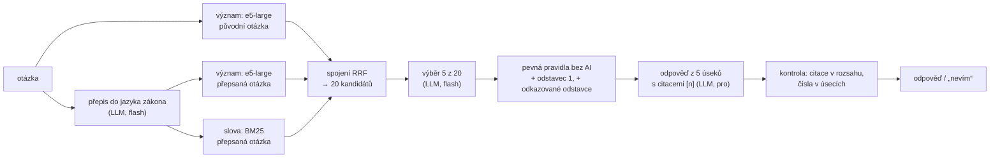
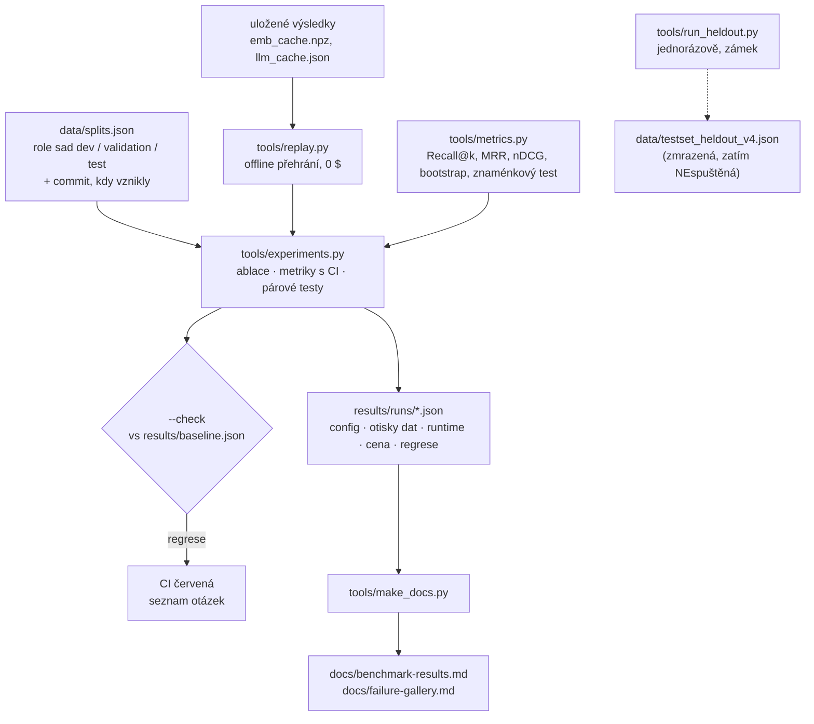

# Architektura

Jeden retrieval-augmented řetězec nad 4 českými předpisy (2 475 odstavců) a k němu **měřicí vrstva**, která umí odpovědět na otázku „proč to selhalo a pomohla oprava?“.
Záměrně malé: jeden Python modul pro řetězec, jedna sada skriptů pro měření, jedna serverová funkce pro web. Co tu **není** (agent, více uživatelů, fronta, vektorová databáze), je v [limitations.md](limitations.md) i s důvodem.

## 1. Řetězec odpovědi

| Krok | Kde | Co dělá | Co se může pokazit (kategorie v [galerii chyb](failure-gallery.md)) |
|---|---|---|---|
| přepis | `rag.rewrite` | „výplata“ → „mzda“ | přepis odvede hledání jinam (A) |
| hledání | `rag.dense_scores`, `rag.bm25_scores`, `rag.rrf` | význam + slova, spojení pořadí | správný odstavec není mezi 20 (A) |
| výběr | `rag.rerank` | LLM vybere 5 z 20 | vyřadí správný odstavec (B) |
| pravidla | `rag.with_odst1`, `rag.with_refs` | výjimka dostane svůj základ, odkaz se dohledá | – (deterministické, testované) |
| odpověď | `rag.answer` | jen z 5 úseků, citace, „nevím“ | špatné přečtení (C), tvrzení bez opory (D), neměl odpovědět (E), zbytečné „nevím“ (F) |
| kontrola | `tools/answer_checks.py` | citace v rozsahu, čísla v citovaném úseku | **jen v měření, ne v živém řetězci** (viz limity) |

Každý krok jde vypnout a změřit zvlášť (`rag.MODES`), proto jde u každé chyby říct, **kde se řetěz přerušil**.

## 2. Tři kopie hledání (a proč)

Python (`tools/rag.py`, na něm se měří), JavaScript (`site/api/ask.js`, běží na webu jako serverová funkce) a LangChain (`tools/rag_langchain.py`, ukázka frameworku).
Riziko tří kopií je, že se rozejdou. Brání tomu test `test_web_matches_python` (JS a Python dávají stejné pořadí) a paritní kontrola LangChainu (`rag_langchain.py --compare`). Rozhodnutí a jeho cena: [DESIGN.md §9](../DESIGN.md#9-proč-je-hledání-napsané-třikrát).

## 3. Měřicí vrstva

Dvě měření se **záměrně dělí**:
- **Offline přehrání** (CI, zdarma): ověřuje, že se nezměnil KÓD hledání. Opakovatelné na bit.
- **Živé měření** (`tools/evaluate.py`, `tools/run_heldout.py`, `tools/security_eval.py`): ověřuje CHOVÁNÍ MODELU. Stojí peníze, není deterministické, spouští se ručně a zapisuje se do dokumentů.

Proč: viz [ADR-001](decisions/ADR-001-offline-quality-gate.md).

## 4. Web a ochrana

`site/index.html` (jeden soubor, D3 mapa), `site/api/ask.js` (živá otázka: proof of work, 10 otázek na IP, rozpočet na klíči), `site/api/hit.js` (počítadlo kliků, jen připravené otázky). Hrozby a obrany: [security/threat-model.md](../security/threat-model.md).

## 5. Verze, které jdou vystopovat

| Co | Kde je verze |
|---|---|
| Kód | git commit v záznamu o běhu |
| Data a sady | otisky souborů v záznamu o běhu (`datasets`) |
| Modely | `config` v záznamu o běhu (embedding, přepis/výběr, odpověď) |
| Prompty | otisky `prompt_hashes` v záznamu o běhu |
| Role sad | `data/splits.json` (commit, kdy sada vznikla) |

**Návrat ke starší konfiguraci:** git (`git checkout <commit> -- tools/rag.py data/`) a porovnání `results/baseline.json`. Indexy se neverzují zvlášť, protože embeddingy jsou odvozené z `data/chunks.json` a cache podle obsahu textu; jiný model embeddingů = nová cache (stojí API).
Neimplementováno: pojmenované verze konfigurace s přepínačem za běhu.
